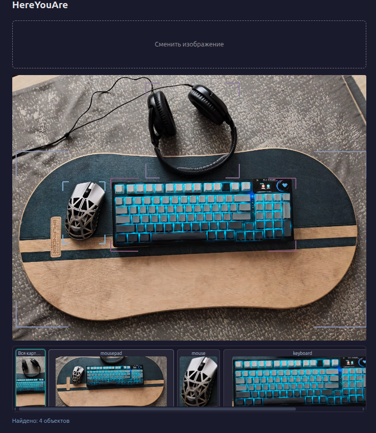
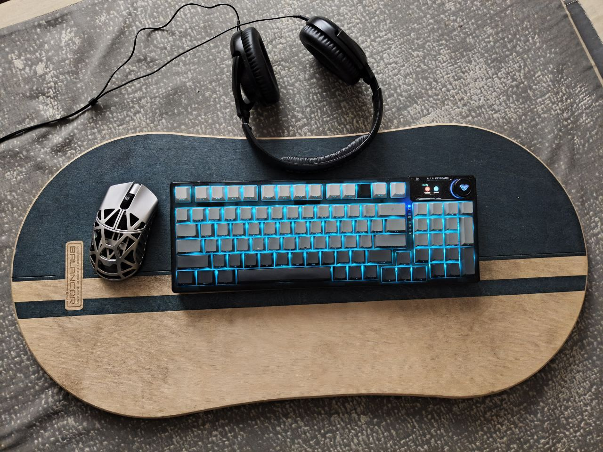
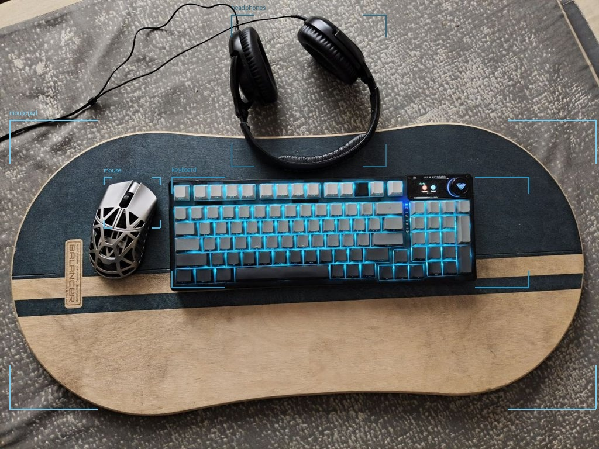

# DockerCore — OpenWebUI + Ollama & Tools

Docker Compose stack that runs **OpenWebUI** with **Ollama** (GPU-backed) and custom tool services: **Time UI** (time/timezone utilities) and **HereYouAre** (vision-based object detection).

## Overview

| Service     | Description |
|------------|-------------|
| **ollama** | Local LLM runtime; runs vision/language models (e.g. qwen2.5-vl). Uses GPU when available. |
| **openwebui** | Web UI for chat and tools; connects to Ollama and to time-ui / hereyouare. |
| **time-ui** | OpenAPI tool: UTC/local time, formatting, timezone conversion. Used by OpenWebUI as a connection. |
| **hereyouare** | Object detection on images via Ollama vision models; returns JSON or an annotated image. |

## Prerequisites

- **Docker** and **Docker Compose**
- **NVIDIA Container Toolkit** (for GPU support with Ollama)

## Quick Start

```bash
# Start all services (Ollama will pull images on first run)
docker compose up -d

# Open Web UI
open http://localhost:3000

# Pull a vision model for HereYouAre (e.g. qwen2.5-vl)
docker exec -it ollama ollama pull qwen2.5vl:7b-q4_K_M
```

- **OpenWebUI:** http://localhost:3000  
- **Ollama API:** http://localhost:11434 (bound to 127.0.0.1)  
- **HereYouAre API:** http://localhost:8082  

## HereYouAre — Object Detection Service

FastAPI service that detects physical objects in images using an Ollama vision model (e.g. **qwen2.5vl**). Images are resized (max side 1024 px), sent to Ollama with a structured prompt, and the response is parsed into bounding boxes.

Для интерактивной работы с детекцией доступно **веб-приложение HereYouAre UI** (React): загрузка изображения, отображение рамок и миниатюр обнаруженных объектов. Пример интерфейса:



### Endpoints

| Method | Path | Description |
|--------|------|-------------|
| GET | `/health` | Health check; returns `{"status": "ok"}`. |
| GET / POST | `/echo` | Echo request (query or body); useful for connectivity checks. |
| POST | `/v1/detect` | Upload an image; returns JSON with image dimensions and a list of detections (label + pixel position `[x1, y1, x2, y2]`). |
| POST | `/v1/detect/image` | Same detection, but returns a **PNG image** with corner-only bounding boxes and labels drawn (same colour tone). |

### Detection response (JSON)

```json
{
  "image": { "width": 1024, "height": 768 },
  "detections": [
    { "label": "keyboard", "position": [360, 375, 1022, 568] },
    { "label": "mouse", "position": [192, 383, 337, 570] }
  ],
  "provider": "qwen2.5vl",
  "latency_ms": 3500
}
```

### Example: detection markup

| Input | Annotated result (corner boxes + labels) |
|-------|----------------------------------------|
|  |  |

*Original image and the same scene with detected objects marked (HereYouAre `/v1/detect/image`).*

### Example usage

```bash
# JSON result
curl -X POST http://localhost:8082/v1/detect \
  -F "file=@photo.jpg"

# Annotated image (PNG)
curl -X POST http://localhost:8082/v1/detect/image \
  -F "file=@photo.jpg" \
  --output annotated.png
```

- **Swagger UI:** http://localhost:8082/docs  
- **ReDoc:** http://localhost:8082/redoc  

### Configuration

Edit `hereyouare/settings.py` to change:

- **Ollama** URL, model name, timeout, temperature
- **Prompt** and **FORMAT_SCHEMA** (guided JSON output)
- **Image** max side, JPEG quality
- **OLLAMA_CONCURRENCY** (default 1 to avoid overloading the GPU)

## Optional: HTTPS reverse proxy

The stack includes a commented **nginx** service for HTTPS (e.g. for remote microphone or production). Uncomment it in `docker-compose.yaml`, then create certificates (see `nginx/ssl/README.txt` or `nginx/ssl/gen-selfsigned.sh`) and adjust `nginx/conf.d` as needed.

## Project layout

```
.
├── docker-compose.yaml   # Ollama, OpenWebUI, time-ui, hereyouare (optional nginx)
├── hereyouare/           # Object detection API (FastAPI, Pillow, orjson)
│   ├── main.py
│   ├── settings.py
│   ├── Dockerfile
│   └── requirements.txt
├── time-ui/              # Time tool (OpenAPI)
├── nginx/                # Optional reverse proxy config and SSL
└── README.md
```

## License

See repository or project-specific files for license information.
